# Frontend

This project was generated using [Angular CLI](https://github.com/angular/angular-cli) version 19.0.5.

## Development server

To start a local development server, run:

```bash
npm install
ng serve
```

Once the server is running, open your browser and navigate to `http://localhost:4200/`. The application will automatically reload whenever you modify any of the source files.

## User Guide
### Home page
On the home page you can find a navbar with 4 links, Men, Women, Kids and Update. 3 of them to explore the collection and the last one to update the cloth database. 
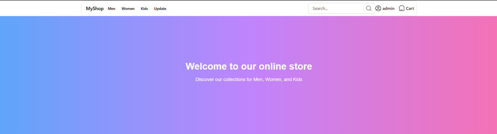
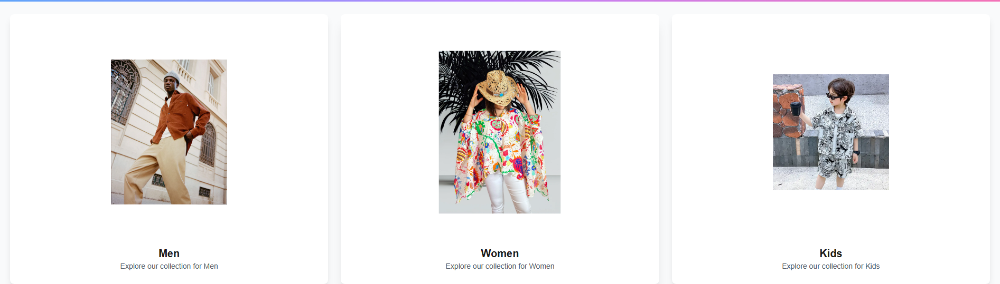
### Update page
On the Update page, there is a list of existing products that we can update and we can add products as well.
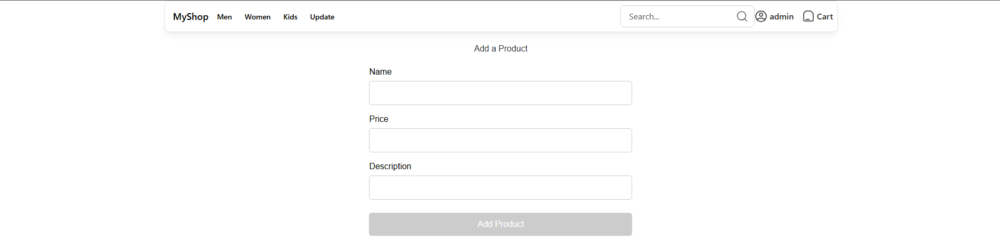
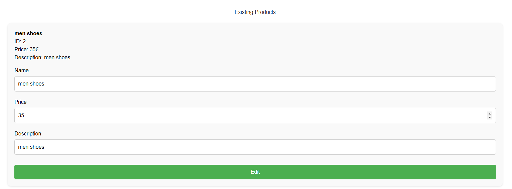

### Men, Women and Kids pages
On that pages, you can explore the collection and add them to crat
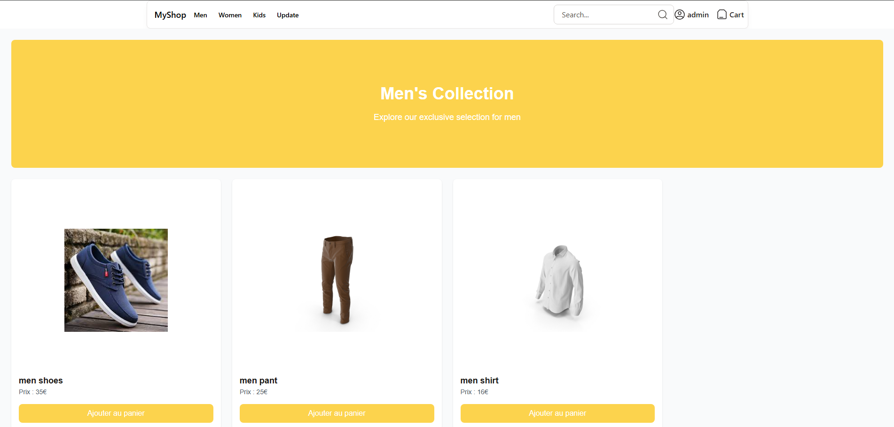

### Login page
On this page you can lo in or create an account. Once you are logged in, your username will be displayer on the navbar top right corner

Before :
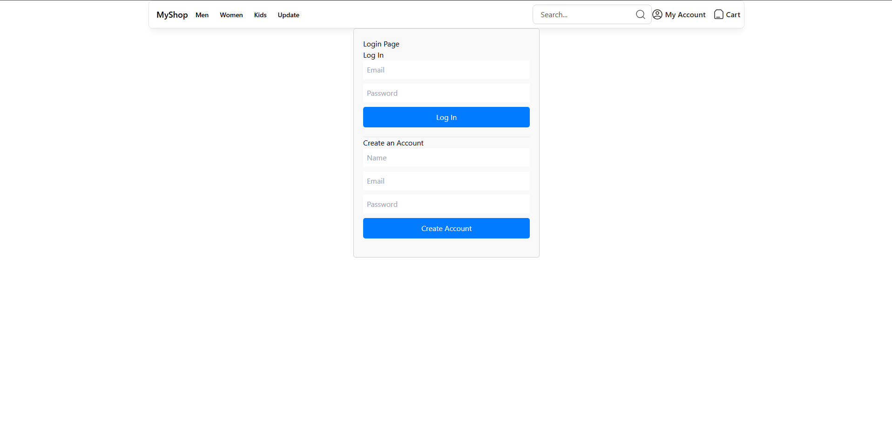
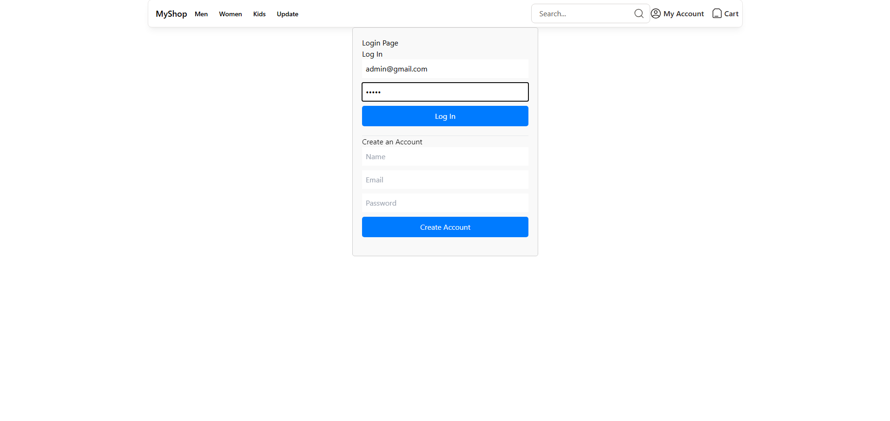
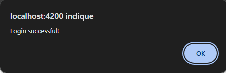

After:
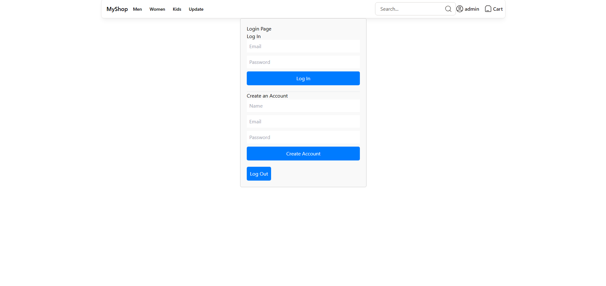
And youu will be redirected to the home page

### Search page 
You can search for an item via the navbar search input like so :
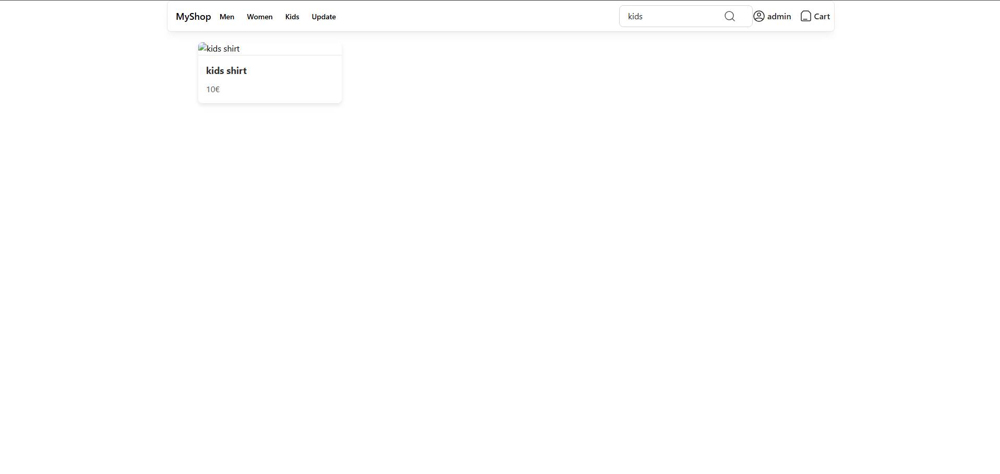
Only the products that contain the exact word in the searchbar in their names will be displayed on the screen

### Cart page
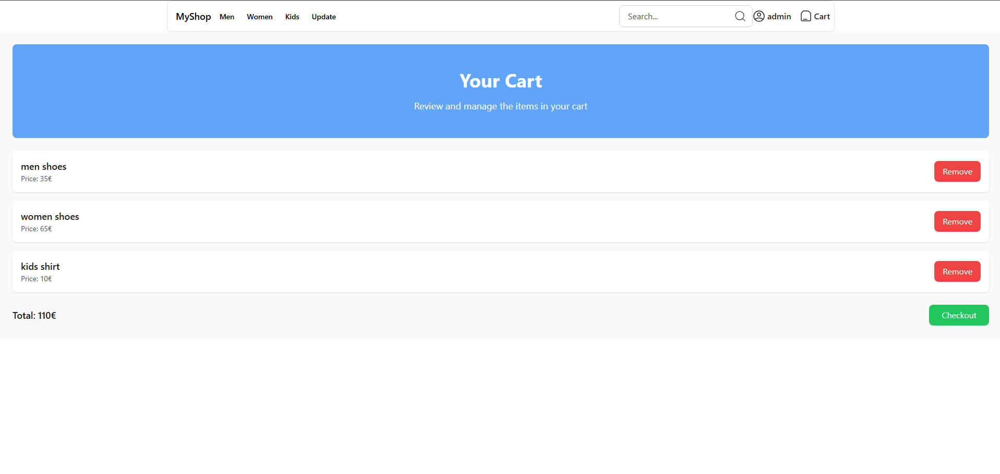
The last page is the cart page. All the products you added to cart will be displayed here. You can remove them or checkout.
